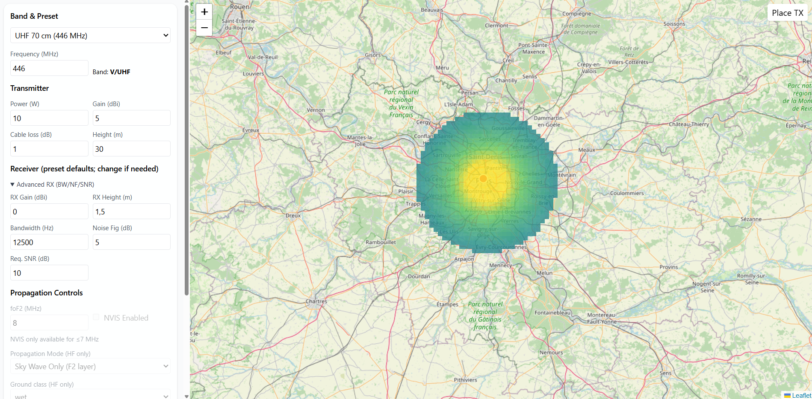

## IONO RF Coverage Explorer (HF & V/UHF)

Interactive RF coverage sandbox built with React, TypeScript and Vite. It visualizes link margin (dB) over a map for **HF (3–30 MHz)** and **V/UHF (30–3000 MHz)** using simplified, well‑documented propagation models.



---

## Goals

- **Educational RF tool**: give operators and engineers an intuitive feel for how band, power, antennas, terrain class and environment affect coverage.
- **Single‑page demo**: fast to run locally, easy to inspect on GitHub (no backend, all compute in the browser / a Web Worker).
- **LLM‑friendly models**: the core HF and V/UHF equations and decision trees are spelled out in plain Markdown (`doc.md`, `HF_EQUATIONS_GUIDE.md`, `visual.md`) so they can be audited or re‑implemented.

---

## What the app does

- **Map‑based RF coverage**: click to place a transmitter and render a link‑margin heatmap (Viridis, \[-10, +30] dB) around it.
- **Band‑aware UI**:
  - **HF**: manual `foF2` slider, NVIS toggle, ground class (sea / wet / dry).
  - **V/UHF**: environment presets (open, rural, urban, forest, water, mountain), k‑factor, optional foliage depth.
- **Propagation logic** (high‑level):
  - **HF (<30 MHz)**: simple hop model with MUF gate (`f ≤ foF2·sec(α)`), one‑hop sky‑wave / NVIS, or short‑range ground‑wave; otherwise the path is treated as blocked.
  - **V/UHF (≥30 MHz)**: LOS vs NLOS path loss with a smooth handover at the radio horizon:
    - LOS: FSPL + two‑slope 2‑ray.
    - NLOS: Hata/COST‑231 in its valid domain (with frequency clamping) or a log‑distance fallback tuned by environment.
    - Optional foliage loss in forest.
- **Link budget**: EIRP, thermal noise, sensitivity, received power, and margin are computed explicitly; only cells with power above a cutoff are painted to avoid a faint “wash” at extreme ranges.

For more detailed equations and validation notes, see `doc.md` (overall spec), `hf_doc.md`, `HF_EQUATIONS_GUIDE.md`, and `visual.md`.

---

## Limits, assumptions, and non‑goals (V1)

- **No real terrain data**:
  - No DEM / clutter model; the engine uses radio‑horizon geometry and median models only.
  - Diffraction and knife‑edge effects are not modeled; the `DIFFRACTION` mode is reserved for a future version.
- **Simplified ionosphere**:
  - `foF2` is a manual slider, not a geospatial / time‑varying model.
  - Fixed virtual F2 height, capped hop count, and a very simple absorption surrogate.
  - Multi‑hop sky‑wave and detailed day/night / seasonal behavior are intentionally out of scope.
- **Median‑case statistics**:
  - V/UHF NLOS is median Hata / log‑distance; small‑scale fading, interference fringes and over‑water ripples are *not* shown.
  - Outputs are for **intuition and relative comparisons**, not for site‑survey‑grade engineering.
- **Single‑TX, low‑res grid**:
  - One transmitter at a time; no interference / network simulation.
  - The grid is down‑sampled for speed; zoom changes spatial extent, not the color scale.

These constraints keep the codebase small and readable while still capturing the main behaviors of HF and V/UHF coverage.

---

## Tech stack

- **Frontend**: React 18 + TypeScript, Vite.
- **Map / UI**: Leaflet + React‑Leaflet, Tailwind CSS, Lucide icons.
- **Compute**: pure TypeScript in `src/core` and `src/propagation`, offloaded to a Web Worker (`coverageWorker.ts`) for the heavy per‑pixel calculations.

The project intentionally avoids extra dependencies beyond the React / mapping / styling toolchain.

---

## Running locally

Prerequisites:

- Node.js 18+ and npm.

Install dependencies:

```powershell
npm install
```

Start the dev server:

```powershell
npm run dev
```

Then open the printed local URL (Vite default is `http://localhost:5173/`).

Build for production:

```powershell
npm run build
```

You can then serve the contents of the generated `dist/` folder with any static file server (the built `dist` artifacts are intentionally not committed to keep this repo source‑only).

---

## Repo layout (high level)

- `src/`
  - `core/`: link budget, shared geometry and RF helpers.
  - `propagation/`: HF and V/UHF models and the propagation engine.
  - `ui/`: React components (`MapView`, `ControlPanel`, `Legend`).
  - `workers/`: coverage worker entry point.
- Root Markdown docs:
  - `doc.md`: end‑to‑end spec for HF and V/UHF models and UI rules.
  - `HF_EQUATIONS_GUIDE.md`: more detailed HF theory and equations.
  - `visual.md`: visual QA expectations and known simplifications.

If you want to dive straight into the RF logic, start with `src/propagation/hfModel.ts`, `src/propagation/vuhfModel.ts`, and `src/propagation/engine.ts`.

---

## License

This project is released under the **MIT License**. See `LICENSE` for details.
